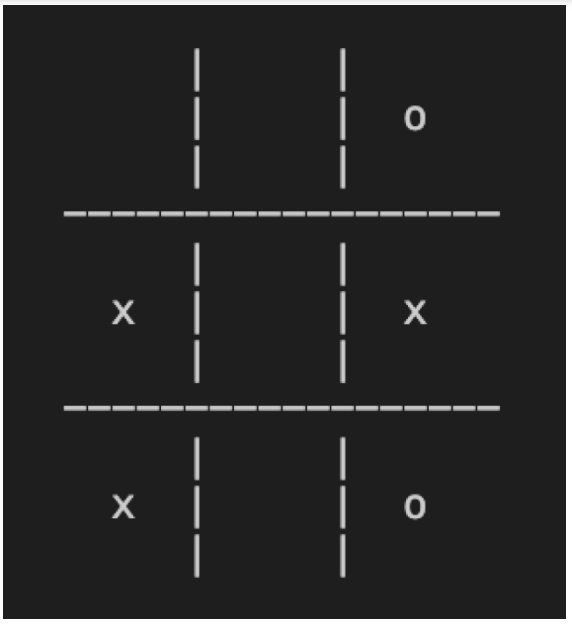

# Activity 4

1. Create 9 variables
   named space1,
   space2… space9
2. Assign either the value
   ‘x’, ‘o’, ‘ ‘ to each of
   these variables
3. Insert the variables
   into the board using
   the f method syntax
   and make your board
   look like the one
   displayed



# Step One

```python
v_line = "     |       |    "
h_line = "-------------------"

print(v_line)

print(v_line)
print(h_line)
print(v_line)
print(v_line)
print(v_line)
print(h_line)
print(v_line)
print(v_line)
print(v_line)
```

The v_line variable isn't going to work as it is since it already has a pre-determined amount of space so it'll be changed

## Step 2

Creating the new Variables as requested, although the activity asks us to create spaces 1-9 this can also be achieved a lot easier if we input the desired variables into an array

```python
v_line = "|"
h_line = "-------------------"
space_0 = " "
space_1 = " "
space_2 = " o "
space_3 = " x "
space_4 = " "
space_5 = " x "
space_6 = " x "
space_7 = " "
space_8 = " o "

spaces = [" ", " ", " O ", " X ", " ", " X ", " X ", " ", " O "]
```

## Step 3

We now print the filled grid with the f method syntax as requested above Since I'm using the array method it can be quite confusing to look at. as it works we only need to edit the middle symbols index of each group of 3 to keep the format.

```python
symbols = [ "O", "X", " "]
print(f"{symbols[2]}{v_line}{symbols[2]}{v_line}{symbols[2]}")
print(f"{symbols[2]}{v_line}{symbols[0]}{v_line}{symbols[1]}")
print(f"{symbols[2]}{v_line}{symbols[2]}{v_line}{symbols[2]}")
print(h_line)
print(f"{symbols[2]}{v_line}{symbols[2]}{v_line}{symbols[2]}")
print(f"{symbols[2]}{v_line}{symbols[1]}{v_line}{symbols[2]}")
print(f"{symbols[2]}{v_line}{symbols[2]}{v_line}{symbols[2]}")
print(h_line)
print(f"{symbols[2]}{v_line}{symbols[2]}{v_line}{symbols[2]}")
print(f"{symbols[1]}{v_line}{symbols[2]}{v_line}{symbols[2]}")
print(f"{symbols[2]}{v_line}{symbols[2]}{v_line}{symbols[2]}")
```
