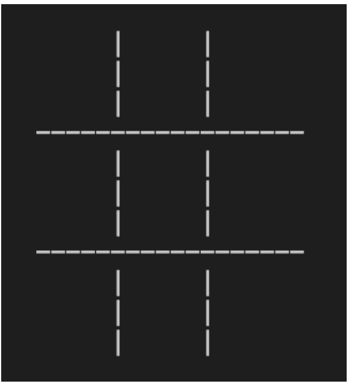

# Activty 3

Have a go at printing a
grid like this to the
terminal..



# Step one

We establish our Variables for the Vertical and Horizontal lines

```python
v_line = "     |       |       |        "
h_line = "=============================="
```

# Step 2

With the v_lines being 3 dashes tall we can create the grid like so, Which rill print the grid to the terminal when executed

```python
v_line = "     |       |    "
h_line = "-------------------"

print(v_line)

print(v_line)
print(h_line)
print(v_line)
print(v_line)
print(v_line)
print(h_line)
print(v_line)
print(v_line)
print(v_line)
```
